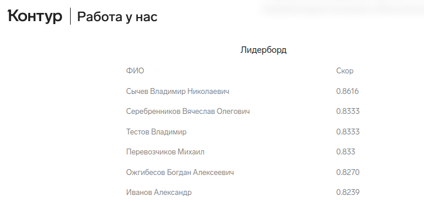

Данная задача представляет собой проблему вопросно-ответной системы с закрытым контекстом (extractive question answering). На это намекает и структура предложенного json файла, близкого к формату датасета для решения QA проблем. Наличие пустых ответов говорит о необходимости принимать во внимание случаи, когда ответ не содержится в контексте (SQUAD_v2).  

Для решения задачи я решил выбрать модель `AlexKay/xlm-roberta-large-qa-multilingual-finedtuned-ru`, дообученную для решения QA проблем. Часть кода получена путем доработки кода [отсюда](https://huggingface.co/learn/nlp-course/chapter7/7). Главным образом, чтобы обеспечить возможность предсказывать отсутствие ответа в контексте. 

### Структура ноутбука:
* перевод данных, разделенных на тренировочную и тестовую части, в DataDict формат для обучения
* дообучение модели
* оценка модели
* дообучение на всех тренировочных данных
* получение частей текста контрактов, содержащих ответы

### Недостатки работы:
* Нецельность пайплайна, в том числе из-за необходимости загрузки моделей для балансировании состояния GPU
* Отсутствие правильной валидации. Я не смог "прикрутить" метрику оценки к Trainer'у
* Получение факта отсутствия ответа в контексте через post-processing, а не через дообучение модели предсказывать для таких случаев сепаратор \<s\>. Стандартно он не включается в видимую область для моделей, обученных на основе SQUAD_v1 

#### UPD
### Leaderboard

Итоговое положение -- **4 место**. Точность выделения (exact match)-- 0.833
